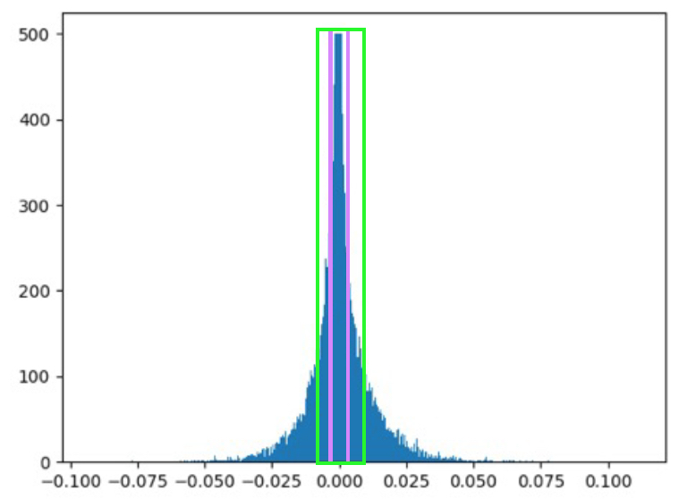

# nn-compression

# Introduction
  Over the years there has been tremendous interest and effort in moving deep learning applications to mobile and embedded platforms. Being a self-driving car enthusiast, the applications that immediately caught my attention are vehicle and pedestrian detection and Google Visual Translate as a travel enthusiast. What makes it challenging to move these applications to resource-limited platforms?
  
  The depth of the neural networks plays a crucial role in the extracting the hierarchical information in images, specifically for visual tasks. Even though the architecture of these models have improved over time, a typical model still has billions of operations and millions of parameters. This poses challenges in fitting them in memory, specifically in SRAM as SRAM access is three orders of magnitude cheaper than DRAM access. Reducing the size also helps in transmitting the apps built on such models as currently there is a 100MB limit for over the air download of iOS apps.  
  
  There are many techniques for compressing neural networks such as: [Distillation](https://arxiv.org/abs/1503.02531) - training a smaller model on the softmax proababilities of a larger model, [Binarized neural networks](https://www.nervanasys.com/accelerating-neural-networks-binary-arithmetic/), compressing the parameters [HashedNets](http://www.cse.wustl.edu/~ychen/HashedNets/), [in frequency domain](https://arxiv.org/abs/1506.04449), [pruning](https://arxiv.org/abs/1510.00149), [quantization](https://petewarden.com/2016/05/03/how-to-quantize-neural-networks-with-tensorflow/) and many others.
  
  To begin with, I decided to start experimenting with pruning the weights and explore quantization if time permits. This repo is my implementation of itertive histogram based pruning and fine-tuning of the weights to compress a trained neural network without any significant loss of accuracy (inspired by [1]).

[1]:https://arxiv.org/abs/1510.00149
  
# Framework 
programmed in python2.7. Tools: Tensorflow 0.12, Numpy, openCV

# Credits
The tensorflow implementation of VGG-19 and the trained model in Numpy format are from [Chris](https://github.com/machrisaa/tensorflow-vgg). The model implementation was modified to take the images pre-processed using openCV as input.  

# Pruning
  The mapping of the neurons between two successive layers is represented by a weight matrix (ignoring the bias vector for now). The distribution of the weights can be represented by a histogram as shown below:

  
# Feasibility experiments
