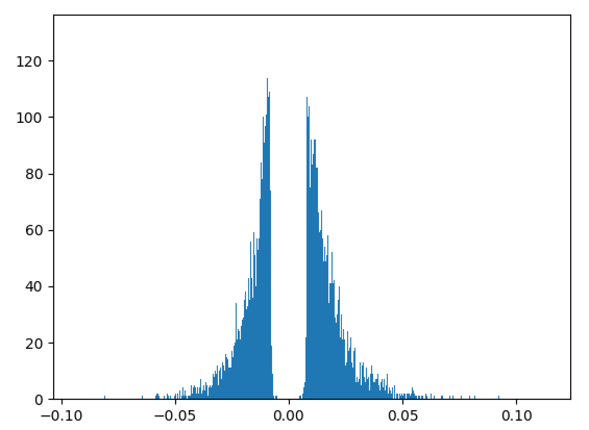

# nn-compression

## Introduction
  Over the years there has been tremendous interest and effort in moving deep learning applications to mobile and embedded platforms. Being a self-driving car enthusiast, the applications that immediately caught my attention are vehicle and pedestrian detection and Google Visual Translate as a travel enthusiast. What makes it challenging to move these applications to resource-limited platforms?
  
  The depth of the neural networks plays a crucial role in the extracting the hierarchical information in images, specifically for visual tasks. Even though the architecture of these models have improved over time, a typical model still has billions of operations and millions of parameters. This poses challenges in fitting them in memory, specifically in SRAM as SRAM access is three orders of magnitude cheaper than DRAM access. Reducing the size also helps in transmitting the apps built on such models as currently there is a 100MB limit for over the air download of iOS apps.  
  
  There are many techniques for compressing neural networks such as: [Distillation](https://arxiv.org/abs/1503.02531) - training a smaller model on the softmax proababilities of a larger model, [Binarized neural networks](https://www.nervanasys.com/accelerating-neural-networks-binary-arithmetic/), compressing the parameters [HashedNets](http://www.cse.wustl.edu/~ychen/HashedNets/), [in frequency domain](https://arxiv.org/abs/1506.04449), [pruning](https://arxiv.org/abs/1510.00149), [quantization](https://petewarden.com/2016/05/03/how-to-quantize-neural-networks-with-tensorflow/) and many others.
  
  To begin with, I decided to start experimenting with pruning the weights and explore quantization if time permits. This repo is my implementation of itertive histogram based pruning and fine-tuning of the weights to compress a trained neural network without any significant loss of accuracy (inspired by [1]).

[1]:https://arxiv.org/abs/1510.00149
  
## Framework 
programmed in python2.7. Tools: Tensorflow 0.12, Numpy, openCV

## Credits
The tensorflow implementation of VGG-19 and the trained model in Numpy format are from [Chris](https://github.com/machrisaa/tensorflow-vgg). The model implementation was modified to take the images pre-processed using openCV as input.  

## Pruning
  The mapping of the neurons between two successive layers is represented by a weight matrix (ignoring the bias vector for now). The distribution of the weights can be represented by a histogram as shown below:
 

It can be seen that the majority of the weights are distributed around the zero mean and can be removed without any significant loss of accuracy. After removing the weights, the network is retrained or fine-tuned so that the remaining weights readjust and learn the mappings. If present, the drop-out ratio is adjusted accordingly to account for the reduction in the number of weights by pruning. This gradual iterative pruning and fine-tuning of the weights, results in a higher reduction in the number of the weights pruned when compared to pruning the trained network just once. The threshold for pruning is based on the standard deviation of the weights in the matrix and is gradually increased till the drop in accuracy cannot be recovered by fine-tuning. After pruning the weights, the isolated/dead neurons that do not have any incoming/outgoing connections can be safely removed. The weight matrix after pruning is saved as a sparse matrix in CSR (value, index, shape) format. 

### Take-away:
If the reduction factor is less than ~5-7X, storing in CSR format is costlier than the raw array format.
  
## Feasibility experiments
  Due to the depth of these networks, they are pruned in stages working on a sub-set of layers while fixing the weights of the remaining layers at their trained value. The sub-set of layers for pruning are decided based on the architecture. The general rule of thumb seems to be: group layers that have a similar size and distribution of the weight matrix and prune the weights by gradually increasing the threshold.
  
  The initial experiments were performed on the LeNet5 architecture for MNIST classification. LeNet5 was pruned on a layer by layer basis and in two groups namely the convolution and fully connected layers. Due to the relative simplicity of this task, the network was pruned once after training followed by fine-tuning for 10-25 epochs.
  
### Take-aways:
1. Group layers with similar size and distribution of weights. (LeNet5 has only 5 layers and pruning layer by layer gives a higher reduction in the number of parameters in each layer compared to pruning in two groups. Alternatively, pruning layer by layer allows better tuning of the threshold for pruning)
2. Overall 6X parameters can be reduced by pruning
3. ~10X reduction for fully connected and ~1.5-2.5X reduction for convolution layers
4. Pruned weights occupy one-third memory needed by the base weights

## Prunning VGG19
  VGG19 is one the top-performing models in the ImageNet challenge for classification. As it has the maximum number of parameters (~548MB), I tested the performace of pruning based compression on this to better understand the challenges and limitations. I used the 50K validation images from the ILSVRC-2014 with 50 images per class for the 1000 output categories. The images were minimally pre-processed in openCV (mean subtract and random crops of 224x224) and split into train, valid and test batches.
  
  The network was iteratively pruned at various step-sizes of the pruning threshold: (increments of 0.1 and 0.2, with and without fine-tuning). 
  
### Take-aways:
1. Pruning a larger network is a slow process (>36 hours)
2. Reduction factor is heavily dependent on the smoothness of pruning process
3. Overall 5X reduction, 2.5-4.5X reduction for convolution and upto ~18X reduction for fully connected layers
4. Can be improved with reduction in the step-size of the threshold and more fine-tuning 
5. The pruned weights still occupy one-third memory needed by the base weights

This leads us to the next and further improvements section.
